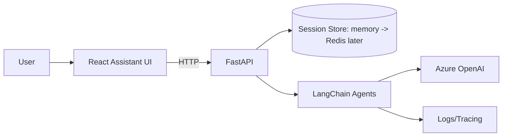

# Cursor Spec Pack — Architecture Design Agent (Recursive + Patch + Delta)

> **Goal**: Build an AI Architecture Consultant app that iteratively collects requirements, continuously updates system architecture, explains trade-offs, and generates lightweight diagrams.  
> **Stack**: Python + FastAPI + LangChain + OpenAI/Gemini, Vite + React (Assistant UI), uv, pnpm, Tailwind, Mermaid.js  
> **Key behaviors**: **Recursive flow**, **Patch on LOW + MEDIUM changes**, **Regenerate on HIGH changes**, always return **Delta View** when architecture changes.

---

## 0) What you get in this pack

This document is “Cursor-ready”: you can paste into Cursor and create the files.

### Included
- Full project structure (backend + frontend)
- Core data models (Pydantic) for requirements, architecture output, delta view
- Agents:
  - Requirements Patch Agent (merges new info, asks targeted questions)
  - Impact Analyzer (classifies change impact)
  - Architecture Generator Agent (full generation)
  - Architecture Patch Agent (patches existing architecture for **low/medium** impact)
- Delta computation utility (fallback if model omits delta)
- FastAPI routes for recursive chat flow
- React UI skeleton to chat + render Mermaid diagrams
- Documentation for a technical expert (architecture, flow, extensibility)

---

# 1) System Overview (Technical)

## 1.1 Product concept
**Architecture Design Agent** acts as an AI architecture consultant. Users iteratively describe their product (“add feature X”, “now need compliance Y”, “scale changed”), and the system keeps a structured requirements state and architecture version.

## 1.2 High-level architecture



## 1.3 Agent flow (recursive)

```mermaid
flowchart TD
  A[User message] --> B[Patch Requirements]
  B --> C{Need more critical info?}
  C -- Yes --> D[Ask 3-5 targeted questions]
  D --> A
  C -- No --> E[Impact Analysis]
  E --> F{Impact level}
  F -- None --> G[Return current architecture + notes]
  F -- Low --> H[Patch Architecture (low)]
  F -- Medium --> I[Patch Architecture (medium)]
  F -- High --> J[Regenerate Architecture]
  H --> K[Attach Delta View]
  I --> K
  J --> K
  K --> A
```

### Impact policy
- **HIGH** → Full **regeneration** (may change style, introduce new subsystems)
- **MEDIUM** → **Patch** existing architecture (preserve continuity, add components only as needed)
- **LOW** → **Patch** lightly (update decisions/notes, minimal diagram edits, small delta)
- **NONE** → Return existing architecture (no delta), just update requirements state

> You requested: **Patch on medium and low** — implemented.

---

# 2) User Inputs (How users should interact)

## 2.1 Free-text chat (primary)
Users can type in natural language at any time:
- “Build a scalable e-commerce app, MVP in 6 weeks, 20k MAU.”
- “Add payments via Stripe and require audit logs.”
- “We need realtime chat.”
- “Scale to 1M MAU and multi-region.”

## 2.2 Intake questions (only when necessary)
The Requirements Patch Agent asks only **high-impact** questions, max **5 at a time**, e.g.:
- Scale: MAU / peak RPS?
- Compliance: PCI/GDPR/HIPAA?
- Team size/timeline?
- Cloud preference?
- Realtime? payments? multi-tenancy?

The agent proceeds with explicit **assumptions** if the user doesn’t know.

---

# 3) Output (What the agent returns)

Every architecture response is structured JSON with these sections:
- Requirements summary (functional + NFR + constraints)
- Assumptions
- Options (Option A / B)
- Trade-off matrix
- Recommendation
- Diagram (Mermaid)
- Implementation plan
- **Canonical architecture** (stable component list)
- **Delta view** (changes from previous version)

Delta view includes:
- What changed
- New components added
- What stayed the same
- Migration steps

---

# 4) Project Structure

```text
repo/
  backend/
    pyproject.toml
    uv.lock
    app/
      main.py
      api/
        routes_chat.py
        routes_health.py
      agents/
        requirements_patch_agent.py
        impact_analyzer.py
        architecture_agent.py
        architecture_patch_agent.py
        prompts/
          intake_system.md
          impact_system.md
          arch_system.md
          arch_patch_system.md
      services/
        session_service.py
        delta_service.py
      models/
        schemas.py
      core/
        config.py
        logging.py
      tests/
        test_schema_contracts.py
        test_delta.py
  frontend/
    package.json
    pnpm-lock.yaml
    vite.config.ts
    index.html
    src/
      main.tsx
      app/App.tsx
      app/ChatPage.tsx
      lib/api.ts
      lib/types.ts
      components/
        Chat/Composer.tsx
        Chat/MessageList.tsx
        MermaidRenderer.tsx
      styles/index.css
  .env.example
  README.md
  docs/
    technical-overview.md
    agent-behavior.md
    api.md
    runbook.md
```

---

# 5) Backend — Implementation

## 5.1 Environment variables

Create `backend/.env` (example in `.env.example`):

- `AZURE_OPENAI_ENDPOINT`
- `AZURE_OPENAI_API_KEY`
- `AZURE_OPENAI_API_VERSION`
- `AZURE_OPENAI_DEPLOYMENT`

---

## 5.2 Backend files

> Create these files exactly as shown.

### `backend/app/core/config.py`

```python
from pydantic import BaseModel
import os


class Settings(BaseModel):
    azure_openai_endpoint: str = os.getenv("AZURE_OPENAI_ENDPOINT", "")
    azure_openai_api_key: str = os.getenv("AZURE_OPENAI_API_KEY", "")
    azure_openai_api_version: str = os.getenv("AZURE_OPENAI_API_VERSION", "")
    azure_openai_deployment: str = os.getenv("AZURE_OPENAI_DEPLOYMENT", "")

    # Tuning
    temperature: float = float(os.getenv("LLM_TEMPERATURE", "0.3"))


settings = Settings()
```

### `backend/app/core/logging.py`

```python
import logging


def setup_logging(level: str = "INFO"):
    logging.basicConfig(
        level=level,
        format="%(asctime)s %(levelname)s %(name)s %(message)s",
    )
```

---

## 5.3 Pydantic Schemas

### `backend/app/models/schemas.py`

```python
from __future__ import annotations

from datetime import datetime
from typing import Any, Dict, List, Literal, Optional

from pydantic import BaseModel, Field


class UsersAndScale(BaseModel):
    expected_users: Optional[str] = None
    peak_requests: Optional[str] = None
    data_growth: Optional[str] = None


class NFRs(BaseModel):
    availability: Optional[str] = None
    latency: Optional[str] = None
    scalability: Optional[str] = None
    security: List[str] = Field(default_factory=list)
    compliance: List[str] = Field(default_factory=list)


class Constraints(BaseModel):
    timeline: Optional[str] = None
    budget: Optional[Literal["low", "medium", "high"]] = None
    team_size: Optional[int] = None
    team_skills: List[str] = Field(default_factory=list)


class Preferences(BaseModel):
    cloud: Optional[str] = None  # azure/aws/gcp/agnostic
    deployment: Optional[str] = None  # containers/serverless/vm/unknown
    database: Optional[str] = None


class ChangeEntry(BaseModel):
    version: int
    timestamp: datetime
    user_message: str
    summary: str
    fields_changed: List[str] = Field(default_factory=list)


class RequirementsMeta(BaseModel):
    version: int = 0
    last_updated: Optional[datetime] = None
    change_log: List[ChangeEntry] = Field(default_factory=list)


class Requirements(BaseModel):
    app_name: Optional[str] = None
    domain: Optional[str] = None
    core_features: List[str] = Field(default_factory=list)
    integrations: List[str] = Field(default_factory=list)

    users_and_scale: UsersAndScale = Field(default_factory=UsersAndScale)
    nfrs: NFRs = Field(default_factory=NFRs)
    constraints: Constraints = Field(default_factory=Constraints)
    preferences: Preferences = Field(default_factory=Preferences)

    constraints_notes: List[str] = Field(default_factory=list)
    meta: RequirementsMeta = Field(default_factory=RequirementsMeta)


class ClarifyingQuestion(BaseModel):
    key: str
    question: str
    reason: str


class IntakeDecision(BaseModel):
    status: Literal["need_more_info", "ready"]
    extracted: Requirements

    missing_critical: List[str] = Field(default_factory=list)
    questions: List[ClarifyingQuestion] = Field(default_factory=list)
    assumptions: List[str] = Field(default_factory=list)

    # Optional enhancements for better delta/UX
    change_summary: Optional[str] = None
    fields_changed: List[str] = Field(default_factory=list)  # dot-paths e.g. "nfrs.compliance"


class ImpactAnalysis(BaseModel):
    impact: Literal["none", "low", "medium", "high"]
    reasons: List[str] = Field(default_factory=list)
    should_patch: bool = False
    should_regenerate: bool = False
    suggested_followups: List[str] = Field(default_factory=list)


class ArchitectureOption(BaseModel):
    name: str
    summary: str
    components: List[str]
    when_to_choose: List[str]
    when_not_to_choose: List[str]


class DeltaView(BaseModel):
    version_from: int
    version_to: int

    what_changed: List[str] = Field(default_factory=list)
    new_components_added: List[str] = Field(default_factory=list)
    components_removed: List[str] = Field(default_factory=list)
    unchanged_components: List[str] = Field(default_factory=list)

    decisions_changed: List[str] = Field(default_factory=list)
    diagram_changes: List[str] = Field(default_factory=list)

    migration_steps: List[str] = Field(default_factory=list)
    risk_notes: List[str] = Field(default_factory=list)


class CanonicalArchitecture(BaseModel):
    style: Optional[str] = None
    components: List[str] = Field(default_factory=list)
    data_stores: List[str] = Field(default_factory=list)
    async_mechanisms: List[str] = Field(default_factory=list)
    infra_notes: List[str] = Field(default_factory=list)
    key_decisions: List[str] = Field(default_factory=list)


class ArchitectureOutput(BaseModel):
    requirements: Requirements
    assumptions: List[str]

    architecture_options: List[ArchitectureOption]
    tradeoffs: Dict[str, Any]
    recommended: Dict[str, Any]

    diagram: Dict[str, str]  # {"type":"mermaid","content":"..."}
    implementation_plan: Dict[str, Any]
    open_questions: List[str] = Field(default_factory=list)

    canonical: CanonicalArchitecture = Field(default_factory=CanonicalArchitecture)
    delta: Optional[DeltaView] = None


class ChatRequest(BaseModel):
    message: str
    session_id: Optional[str] = None


class ChatResponse(BaseModel):
    session_id: str
    stage: Literal["intake", "architecture"]

    intake: Optional[IntakeDecision] = None
    impact: Optional[ImpactAnalysis] = None
    architecture: Optional[ArchitectureOutput] = None
```

---

## 5.4 Session service (in-memory for MVP)

### `backend/app/services/session_service.py`

```python
from __future__ import annotations

from dataclasses import dataclass, field
from typing import Dict, List, Optional
import uuid

from app.models.schemas import ArchitectureOutput, Requirements


@dataclass
class SessionState:
    requirements: Requirements = field(default_factory=Requirements)
    requirements_history: List[Requirements] = field(default_factory=list)
    assumptions: List[str] = field(default_factory=list)

    last_architecture: Optional[ArchitectureOutput] = None
    last_arch_summary: str = ""

    stage: str = "intake"  # intake | architecture


class InMemorySessionStore:
    def __init__(self) -> None:
        self._store: Dict[str, SessionState] = {}

    def get_or_create(self, session_id: Optional[str]) -> tuple[str, SessionState]:
        if session_id and session_id in self._store:
            return session_id, self._store[session_id]
        new_id = session_id or str(uuid.uuid4())
        self._store[new_id] = SessionState()
        return new_id, self._store[new_id]

    def update(self, session_id: str, state: SessionState) -> None:
        self._store[session_id] = state


session_store = InMemorySessionStore()
```

---

## 5.5 Delta service (fallback)

### `backend/app/services/delta_service.py`

```python
from __future__ import annotations

from typing import List

from app.models.schemas import ArchitectureOutput, DeltaView


def _set(xs: List[str]) -> set[str]:
    return set([x.strip() for x in xs if x and x.strip()])


def compute_delta(prev_arch: ArchitectureOutput, new_arch: ArchitectureOutput, version_from: int, version_to: int) -> DeltaView:
    prev = prev_arch.canonical
    curr = new_arch.canonical

    prev_components = _set(prev.components)
    curr_components = _set(curr.components)

    added = sorted(curr_components - prev_components)
    removed = sorted(prev_components - curr_components)
    unchanged = sorted(curr_components & prev_components)

    prev_decisions = _set(prev.key_decisions)
    curr_decisions = _set(curr.key_decisions)
    decisions_changed = sorted((curr_decisions - prev_decisions) | (prev_decisions - curr_decisions))

    what_changed = []
    if added:
        what_changed.append(f"Added components: {', '.join(added)}")
    if removed:
        what_changed.append(f"Removed components: {', '.join(removed)}")
    if decisions_changed:
        what_changed.append(f"Updated decisions: {', '.join(decisions_changed)}")

    diagram_changes = []
    if prev_arch.diagram.get("content") != new_arch.diagram.get("content"):
        diagram_changes.append("Diagram updated to reflect new components/flows.")

    migration_steps = []
    for c in added:
        migration_steps.append(f"Introduce {c} behind a feature flag; deploy and validate.")
    if removed:
        migration_steps.append("Deprecate removed components gradually; migrate traffic/data; then remove.")

    return DeltaView(
        version_from=version_from,
        version_to=version_to,
        what_changed=what_changed,
        new_components_added=added,
        components_removed=removed,
        unchanged_components=unchanged,
        decisions_changed=decisions_changed,
        diagram_changes=diagram_changes,
        migration_steps=migration_steps,
        risk_notes=[],
    )
```

---

# 6) Agents (LangChain + OpenAI/Gemini)

## 6.1 Prompt files
Keep prompts in `backend/app/agents/prompts/` for easy iteration.

### `backend/app/agents/prompts/intake_system.md`

```text
You are a Requirements Patch Agent.

Input:
- current requirements JSON
- latest user message

Tasks:
1) Merge the user message into the existing requirements.
2) Produce a concise change summary and list fields changed (dot-paths).
3) Determine if critical info is missing. If yes, ask ONLY the highest-impact clarifying questions (max 5).
4) If user adds features/constraints, append; only overwrite if user explicitly corrects.
5) If the user says they don't know, proceed with assumptions and mark them.

Critical items:
- domain + core features
- rough scale (users or peak rps)
- timeline + team size
- compliance/security requirements
- key integrations (payments, realtime, external systems)
- cloud/deployment preference

Output MUST be valid JSON matching IntakeDecision schema.
Be concise.
```

### `backend/app/agents/prompts/impact_system.md`

```text
You are an Impact Analyzer.

Given:
- previous requirements JSON
- updated requirements JSON
- previous architecture summary (optional)

Decide:
- impact: none/low/medium/high
- should_patch: true for low or medium when architecture exists
- should_regenerate: true for high
- reasons: list
- suggested_followups: list

Rules:
- HIGH impact: compliance changes (PCI/HIPAA), multi-region DR, multi-tenancy, massive scale increase, realtime requirements, payments introduced, major integration changes, architecture style shift.
- MEDIUM impact: new major modules (search, notifications), performance targets, async workflows.
- LOW impact: minor features, naming changes, small constraint tweaks.
- NONE: no meaningful change.

Output MUST be valid JSON matching ImpactAnalysis schema.
```

### `backend/app/agents/prompts/arch_system.md`

```text
You are an Architecture Design Agent (AI Architecture Consultant).

Given structured requirements and assumptions, you MUST:
- Provide requirements summary + assumptions
- Provide 1-2 architecture options (two when meaningful)
- Provide tradeoffs with a simple comparison matrix
- Recommend one option with rationale
- Produce a VALID Mermaid diagram (flowchart TB) for the recommended option
- Provide risks & mitigations
- Provide an implementation plan (phases/milestones)

Important:
- ALWAYS output `canonical` with stable component names.
- Keep component names consistent across turns.
- Output MUST be valid JSON matching ArchitectureOutput schema.
```

### `backend/app/agents/prompts/arch_patch_system.md`

```text
You are an Architecture Patch Agent.

Goal:
Update an existing architecture to satisfy new requirements while preserving continuity.

Input:
- Previous ArchitectureOutput JSON (including canonical)
- Updated Requirements JSON
- assumptions
- impact reasons

Instructions:
1) Do NOT redesign from scratch unless absolutely necessary (only if impact is effectively high).
2) Keep component names stable; add/remove only as required.
3) Update:
   - tradeoffs and recommendation as needed
   - diagram (VALID Mermaid flowchart TB)
   - canonical
4) ALWAYS include `delta`:
   - what_changed
   - new_components_added/components_removed
   - unchanged_components
   - migration_steps (ordered)
   - risk_notes

Output MUST be valid JSON matching ArchitectureOutput schema.
Be concise and practical.
```

---

## 6.2 Agent implementations

### `backend/app/agents/_llm.py`

```python
from langchain import OpenAI  # generic OpenAI-compatible model, e.g. Gemini
from app.core.config import settings


def azure_llm(temperature: float | None = None) -> AzureChatOpenAI:
    return AzureChatOpenAI(
        azure_endpoint=settings.azure_openai_endpoint,
        api_key=settings.azure_openai_api_key,
        api_version=settings.azure_openai_api_version,
        azure_deployment=settings.azure_openai_deployment,
        temperature=settings.temperature if temperature is None else temperature,
    )
```

### `backend/app/agents/requirements_patch_agent.py`

```python
from __future__ import annotations

from pathlib import Path

from langchain_core.messages import HumanMessage, SystemMessage

from app.agents._llm import azure_llm
from app.models.schemas import IntakeDecision, Requirements

PROMPT_PATH = Path(__file__).parent / "prompts" / "intake_system.md"


def patch_requirements(user_message: str, current: Requirements) -> IntakeDecision:
    system_text = PROMPT_PATH.read_text(encoding="utf-8")

    llm = azure_llm(temperature=0.2).with_structured_output(IntakeDecision)
    messages = [
        SystemMessage(content=system_text),
        HumanMessage(
            content=(
                "Current Requirements JSON:\n"
                f"{current.model_dump_json(indent=2)}\n\n"
                "User message:\n"
                f"{user_message}\n\n"
                "Return IntakeDecision JSON now."
            )
        ),
    ]
    return llm.invoke(messages)
```

### `backend/app/agents/impact_analyzer.py`

```python
from __future__ import annotations

from pathlib import Path

from langchain_core.messages import HumanMessage, SystemMessage

from app.agents._llm import azure_llm
from app.models.schemas import ImpactAnalysis, Requirements

PROMPT_PATH = Path(__file__).parent / "prompts" / "impact_system.md"


def analyze_impact(prev_req: Requirements, new_req: Requirements, prev_arch_summary: str = "") -> ImpactAnalysis:
    system_text = PROMPT_PATH.read_text(encoding="utf-8")

    llm = azure_llm(temperature=0.1).with_structured_output(ImpactAnalysis)
    messages = [
        SystemMessage(content=system_text),
        HumanMessage(
            content=(
                "Previous requirements JSON:\n"
                f"{prev_req.model_dump_json(indent=2)}\n\n"
                "Updated requirements JSON:\n"
                f"{new_req.model_dump_json(indent=2)}\n\n"
                "Previous architecture summary (optional):\n"
                f"{prev_arch_summary}\n\n"
                "Return ImpactAnalysis JSON now."
            )
        ),
    ]
    return llm.invoke(messages)
```

### `backend/app/agents/architecture_agent.py`

```python
from __future__ import annotations

from pathlib import Path

from langchain_core.messages import HumanMessage, SystemMessage

from app.agents._llm import azure_llm
from app.models.schemas import ArchitectureOutput, Requirements

PROMPT_PATH = Path(__file__).parent / "prompts" / "arch_system.md"


def generate_architecture(req: Requirements, assumptions: list[str]) -> ArchitectureOutput:
    system_text = PROMPT_PATH.read_text(encoding="utf-8")

    llm = azure_llm(temperature=0.3).with_structured_output(ArchitectureOutput)
    messages = [
        SystemMessage(content=system_text),
        HumanMessage(
            content=(
                "Requirements JSON:\n"
                f"{req.model_dump_json(indent=2)}\n\n"
                "Assumptions:\n"
                f"{assumptions}\n\n"
                "Return ArchitectureOutput JSON now."
            )
        ),
    ]
    return llm.invoke(messages)
```

### `backend/app/agents/architecture_patch_agent.py`

```python
from __future__ import annotations

from pathlib import Path

from langchain_core.messages import HumanMessage, SystemMessage

from app.agents._llm import azure_llm
from app.models.schemas import ArchitectureOutput, Requirements

PROMPT_PATH = Path(__file__).parent / "prompts" / "arch_patch_system.md"


def patch_architecture(prev_arch: ArchitectureOutput, req: Requirements, assumptions: list[str], impact_reasons: list[str]) -> ArchitectureOutput:
    system_text = PROMPT_PATH.read_text(encoding="utf-8")

    llm = azure_llm(temperature=0.2).with_structured_output(ArchitectureOutput)
    messages = [
        SystemMessage(content=system_text),
        HumanMessage(
            content=(
                "Previous ArchitectureOutput JSON:\n"
                f"{prev_arch.model_dump_json(indent=2)}\n\n"
                "Updated Requirements JSON:\n"
                f"{req.model_dump_json(indent=2)}\n\n"
                "Assumptions:\n"
                f"{assumptions}\n\n"
                "Impact reasons:\n"
                f"{impact_reasons}\n\n"
                "Return updated ArchitectureOutput JSON now."
            )
        ),
    ]
    return llm.invoke(messages)
```

---

# 7) FastAPI Routes (Recursive Chat)

## `backend/app/api/routes_health.py`

```python
from fastapi import APIRouter

router = APIRouter()


@router.get("/health")
def health():
    return {"status": "ok"}
```

## `backend/app/api/routes_chat.py`

```python
from __future__ import annotations

from copy import deepcopy
from datetime import datetime

from fastapi import APIRouter

from app.agents.architecture_agent import generate_architecture
from app.agents.architecture_patch_agent import patch_architecture
from app.agents.impact_analyzer import analyze_impact
from app.agents.requirements_patch_agent import patch_requirements
from app.models.schemas import ChatRequest, ChatResponse, ChangeEntry
from app.services.delta_service import compute_delta
from app.services.session_service import session_store

router = APIRouter()


@router.post("/chat", response_model=ChatResponse)
def chat(req: ChatRequest):
    session_id, state = session_store.get_or_create(req.session_id)

    prev_req = deepcopy(state.requirements)
    prev_arch = deepcopy(state.last_architecture)

    # 1) Patch requirements
    intake = patch_requirements(req.message, state.requirements)
    state.requirements = intake.extracted

    # Versioning and change log
    meta = state.requirements.meta
    meta.version += 1
    meta.last_updated = datetime.utcnow()
    meta.change_log.append(
        ChangeEntry(
            version=meta.version,
            timestamp=meta.last_updated,
            user_message=req.message,
            summary=intake.change_summary or "Updated requirements",
            fields_changed=intake.fields_changed,
        )
    )

    # merge assumptions
    state.assumptions = list(dict.fromkeys(state.assumptions + intake.assumptions))

    # keep history
    state.requirements_history.append(prev_req)

    # 2) Still missing critical info → ask questions, but keep last architecture visible
    if intake.status == "need_more_info":
        state.stage = "intake"
        session_store.update(session_id, state)
        return ChatResponse(
            session_id=session_id,
            stage="intake",
            intake=intake,
            impact=None,
            architecture=state.last_architecture,
        )

    # 3) If no architecture yet: generate
    if state.last_architecture is None:
        arch = generate_architecture(state.requirements, state.assumptions)
        state.last_architecture = arch
        state.last_arch_summary = _arch_summary(arch)
        state.stage = "architecture"
        session_store.update(session_id, state)
        return ChatResponse(session_id=session_id, stage="architecture", intake=intake, impact=None, architecture=arch)

    # 4) Impact analysis
    impact = analyze_impact(prev_req, state.requirements, state.last_arch_summary)

    # Map policy: Patch on LOW + MEDIUM, regenerate on HIGH
    if impact.impact in ["low", "medium"]:
        new_arch = patch_architecture(state.last_architecture, state.requirements, state.assumptions, impact.reasons)

        # Ensure delta exists (fallback if model omitted)
        if new_arch.delta is None and prev_arch is not None:
            new_arch.delta = compute_delta(prev_arch, new_arch, version_from=prev_req.meta.version, version_to=state.requirements.meta.version)

        state.last_architecture = new_arch
        state.last_arch_summary = _arch_summary(new_arch)
        state.stage = "architecture"
        session_store.update(session_id, state)
        return ChatResponse(session_id=session_id, stage="architecture", intake=intake, impact=impact, architecture=new_arch)

    if impact.impact == "high":
        new_arch = generate_architecture(state.requirements, state.assumptions)
        if new_arch.delta is None and prev_arch is not None:
            new_arch.delta = compute_delta(prev_arch, new_arch, version_from=prev_req.meta.version, version_to=state.requirements.meta.version)

        state.last_architecture = new_arch
        state.last_arch_summary = _arch_summary(new_arch)
        state.stage = "architecture"
        session_store.update(session_id, state)
        return ChatResponse(session_id=session_id, stage="architecture", intake=intake, impact=impact, architecture=new_arch)

    # impact == none
    state.stage = "architecture"
    session_store.update(session_id, state)
    return ChatResponse(session_id=session_id, stage="architecture", intake=intake, impact=impact, architecture=state.last_architecture)


def _arch_summary(arch) -> str:
    try:
        rec = arch.recommended
        name = rec.get("name", "")
        rationale = rec.get("rationale", [])
        if isinstance(rationale, list):
            rationale = " ".join(rationale)
        return f"{name} {rationale}".strip()
    except Exception:
        return ""
```

---

## `backend/app/main.py`

```python
from fastapi import FastAPI

from app.api.routes_chat import router as chat_router
from app.api.routes_health import router as health_router
from app.core.logging import setup_logging

app = FastAPI(title="Architecture Design Agent")

setup_logging()

app.include_router(health_router)
app.include_router(chat_router)
```

---

## 5.6 `backend/pyproject.toml` (minimal)

```toml
[project]
name = "architecture-design-agent"
version = "0.1.0"
description = "Recursive architecture consultant agent"
requires-python = ">=3.11"

dependencies = [
  "fastapi>=0.110",
  "uvicorn[standard]>=0.27",
  "pydantic>=2.6",
  "langchain>=0.2",
  "langchain-openai>=0.1",
]

[tool.pytest.ini_options]
testpaths = ["app/tests"]
```

---

# 8) Frontend — Vite + React Assistant UI (Skeleton)

## 8.1 `frontend/package.json`

```json
{
  "name": "architecture-design-agent-ui",
  "private": true,
  "version": "0.1.0",
  "type": "module",
  "scripts": {
    "dev": "vite",
    "build": "vite build",
    "preview": "vite preview"
  },
  "dependencies": {
    "react": "^18.2.0",
    "react-dom": "^18.2.0",
    "mermaid": "^10.9.1"
  },
  "devDependencies": {
    "vite": "^5.0.0",
    "typescript": "^5.0.0",
    "@types/react": "^18.0.0",
    "@types/react-dom": "^18.0.0"
  }
}
```

## 8.2 Types and API client

### `frontend/src/lib/types.ts`

```ts
export type ClarifyingQuestion = {
  key: string;
  question: string;
  reason: string;
};

export type IntakeDecision = {
  status: "need_more_info" | "ready";
  missing_critical: string[];
  questions: ClarifyingQuestion[];
  assumptions: string[];
  change_summary?: string;
  fields_changed: string[];
  extracted: any;
};

export type ImpactAnalysis = {
  impact: "none" | "low" | "medium" | "high";
  reasons: string[];
  should_patch: boolean;
  should_regenerate: boolean;
  suggested_followups: string[];
};

export type DeltaView = {
  version_from: number;
  version_to: number;
  what_changed: string[];
  new_components_added: string[];
  components_removed: string[];
  unchanged_components: string[];
  migration_steps: string[];
  risk_notes: string[];
  diagram_changes: string[];
  decisions_changed: string[];
};

export type ArchitectureOutput = {
  requirements: any;
  assumptions: string[];
  architecture_options: any[];
  tradeoffs: any;
  recommended: any;
  diagram: { type: "mermaid" | "plantuml"; content: string };
  implementation_plan: any;
  open_questions: string[];
  canonical: any;
  delta?: DeltaView;
};

export type ChatResponse = {
  session_id: string;
  stage: "intake" | "architecture";
  intake?: IntakeDecision;
  impact?: ImpactAnalysis;
  architecture?: ArchitectureOutput;
};
```

### `frontend/src/lib/api.ts`

```ts
import type { ChatResponse } from "./types";

export async function sendMessage(message: string, sessionId?: string): Promise<ChatResponse> {
  const res = await fetch("http://localhost:8000/chat", {
    method: "POST",
    headers: { "Content-Type": "application/json" },
    body: JSON.stringify({ message, session_id: sessionId }),
  });
  if (!res.ok) throw new Error(`HTTP ${res.status}`);
  return res.json();
}
```

## 8.3 Mermaid Renderer

### `frontend/src/components/MermaidRenderer.tsx`

```tsx
import { useEffect, useRef } from "react";
import mermaid from "mermaid";

export function MermaidRenderer({ code }: { code: string }) {
  const ref = useRef<HTMLDivElement>(null);

  useEffect(() => {
    mermaid.initialize({ startOnLoad: false, securityLevel: "strict" });
    if (!ref.current) return;

    const id = `mmd-${Math.random().toString(36).slice(2)}`;
    ref.current.innerHTML = `<div class="mermaid" id="${id}">${code}</div>`;

    mermaid.run({ nodes: [ref.current] }).catch(() => {
      if (ref.current) ref.current.innerHTML = "<pre>Invalid diagram</pre>";
    });
  }, [code]);

  return <div ref={ref} />;
}
```

## 8.4 Chat UI skeleton

### `frontend/src/components/Chat/Composer.tsx`

```tsx
import { useState } from "react";

export function Composer({ onSend }: { onSend: (text: string) => void }) {
  const [text, setText] = useState("");

  return (
    <div style={{ display: "flex", gap: 8 }}>
      <input
        value={text}
        onChange={(e) => setText(e.target.value)}
        placeholder="Describe your product or add new requirements..."
        style={{ flex: 1, padding: 10 }}
      />
      <button
        onClick={() => {
          const t = text.trim();
          if (!t) return;
          onSend(t);
          setText("");
        }}
      >
        Send
      </button>
    </div>
  );
}
```

### `frontend/src/components/Chat/MessageList.tsx`

```tsx
export type Msg = { role: "user" | "assistant"; content: string };

export function MessageList({ messages }: { messages: Msg[] }) {
  return (
    <div style={{ display: "flex", flexDirection: "column", gap: 12 }}>
      {messages.map((m, i) => (
        <div key={i} style={{ padding: 12, border: "1px solid #eee", borderRadius: 8 }}>
          <div style={{ fontWeight: 600, marginBottom: 6 }}>{m.role}</div>
          <div style={{ whiteSpace: "pre-wrap" }}>{m.content}</div>
        </div>
      ))}
    </div>
  );
}
```

### `frontend/src/app/ChatPage.tsx`

```tsx
import { useState } from "react";
import { sendMessage } from "../lib/api";
import type { ChatResponse } from "../lib/types";
import { Composer } from "../components/Chat/Composer";
import { MessageList, type Msg } from "../components/Chat/MessageList";
import { MermaidRenderer } from "../components/MermaidRenderer";

export default function ChatPage() {
  const [sessionId, setSessionId] = useState<string | undefined>(undefined);
  const [messages, setMessages] = useState<Msg[]>([]);
  const [last, setLast] = useState<ChatResponse | null>(null);

  async function onSend(text: string) {
    setMessages((m) => [...m, { role: "user", content: text }]);

    const res = await sendMessage(text, sessionId);
    setSessionId(res.session_id);
    setLast(res);

    // Render a concise assistant message for chat transcript
    const assistantText = renderAssistantSummary(res);
    setMessages((m) => [...m, { role: "assistant", content: assistantText }]);
  }

  return (
    <div style={{ maxWidth: 980, margin: "20px auto", padding: 16 }}>
      <h1>Architecture Design Agent</h1>

      <div style={{ display: "grid", gridTemplateColumns: "1fr 1fr", gap: 16, marginTop: 16 }}>
        <div>
          <MessageList messages={messages} />
          <div style={{ marginTop: 16 }}>
            <Composer onSend={onSend} />
          </div>
        </div>

        <div style={{ border: "1px solid #eee", borderRadius: 8, padding: 12 }}>
          <h2>Result</h2>
          {!last && <div>Start by describing your product…</div>}

          {last?.stage === "intake" && (
            <div>
              <h3>Need more info</h3>
              <ul>
                {last.intake?.questions?.map((q) => (
                  <li key={q.key}>
                    <b>{q.question}</b>
                    <div style={{ fontSize: 12, opacity: 0.8 }}>{q.reason}</div>
                  </li>
                ))}
              </ul>
            </div>
          )}

          {last?.architecture && (
            <>
              {last.impact && (
                <div style={{ marginBottom: 12 }}>
                  <b>Impact:</b> {last.impact.impact}
                  <ul>
                    {last.impact.reasons?.map((r, i) => (
                      <li key={i}>{r}</li>
                    ))}
                  </ul>
                </div>
              )}

              {last.architecture.delta && (
                <div style={{ marginBottom: 12 }}>
                  <h3>Delta View</h3>
                  <div>
                    <b>v{last.architecture.delta.version_from}</b> → <b>v{last.architecture.delta.version_to}</b>
                  </div>
                  <ul>
                    {last.architecture.delta.what_changed.map((x, i) => (
                      <li key={i}>{x}</li>
                    ))}
                  </ul>
                  <h4>Migration steps</h4>
                  <ol>
                    {last.architecture.delta.migration_steps.map((x, i) => (
                      <li key={i}>{x}</li>
                    ))}
                  </ol>
                </div>
              )}

              <h3>Diagram</h3>
              <MermaidRenderer code={last.architecture.diagram.content} />
            </>
          )}
        </div>
      </div>
    </div>
  );
}

function renderAssistantSummary(res: ChatResponse): string {
  if (res.stage === "intake") {
    const qs = res.intake?.questions?.map((q) => `- ${q.question}`).join("\n") ?? "";
    return `I need a few details to design the right architecture:\n${qs}`;
  }

  if (res.architecture) {
    const rec = res.architecture.recommended?.name ?? "Recommendation";
    const why = (res.architecture.recommended?.rationale ?? []).slice(0, 3).join("; ");
    return `Recommended: ${rec}\nWhy: ${why}`;
  }

  return "";
}
```

### `frontend/src/app/App.tsx`

```tsx
import ChatPage from "./ChatPage";

export default function App() {
  return <ChatPage />;
}
```

### `frontend/src/main.tsx`

```tsx
import React from "react";
import ReactDOM from "react-dom/client";
import App from "./app/App";

ReactDOM.createRoot(document.getElementById("root")!).render(
  <React.StrictMode>
    <App />
  </React.StrictMode>
);
```

---

# 9) README + Docs

## 9.1 `.env.example`

```bash
# Azure OpenAI
AZURE_OPENAI_ENDPOINT="https://<resource>.openai.azure.com/"
AZURE_OPENAI_API_KEY="<key>"
AZURE_OPENAI_API_VERSION="2024-xx-xx"
AZURE_OPENAI_DEPLOYMENT="<deployment-name>"

# Optional tuning
LLM_TEMPERATURE=0.3
```

## 9.2 `README.md`

```md
# Architecture Design Agent (Recursive)

An AI Architecture Consultant that iteratively gathers requirements, proposes architecture options, explains trade-offs, generates Mermaid diagrams, and supports continuous updates.

## Key Features
- Recursive requirements intake (user can keep adding requirements forever)
- Targeted clarifying questions (max 5) only when critical information is missing
- Impact analysis of requirement changes
- Patch architecture for LOW + MEDIUM impact changes (preserve continuity)
- Regenerate architecture for HIGH impact changes
- Delta View: what changed, new components, what stayed the same, migration steps
- Mermaid diagrams rendered in the UI

## Run locally

### Backend
```bash
cd backend
uv sync
cp ../.env.example .env
uv run uvicorn app.main:app --reload --port 8000
```

### Frontend
```bash
cd frontend
pnpm install
pnpm dev
```

Open UI: http://localhost:5173
Backend: http://localhost:8000

## API
- POST /chat  -> recursive chat endpoint (returns questions or architecture)
- GET /health -> health endpoint

## Notes
- Session store is in-memory for MVP; move to Redis for multi-instance deployments.
- Add streaming later via SSE if desired.
```

---

# 10) Technical Documentation (for experts)

Create `docs/technical-overview.md` with this content:

```md
# Technical Overview — Architecture Design Agent

## Purpose
This system provides architecture consulting outputs (options, tradeoffs, diagrams) from incremental user inputs.

## Components
1. React UI
   - chat interface
   - renders Mermaid diagram
   - shows Delta View and migration steps

2. FastAPI backend
   - stores session state
   - orchestrates agent calls
   - returns structured JSON

3. Agent suite (LangChain + Azure OpenAI)
   - Requirements Patch Agent: merges user text into structured Requirements, asks targeted questions
   - Impact Analyzer: classifies change impact (none/low/medium/high)
   - Architecture Generator: creates architecture from requirements
   - Architecture Patch Agent: modifies previous architecture for low/medium changes and emits delta

## Recursive Flow
For each user message:
1) Patch requirements
2) If critical data missing: ask questions
3) Else run impact analysis
4) If impact low/medium: patch architecture
5) If impact high: regenerate architecture
6) Ensure delta view exists (fallback delta computation)

## Why canonical architecture
We require `canonical.components` etc. to enable stable diffing across versions and avoid prose-diff instability.

## Output contract
Architecture is returned as structured JSON. UI renders:
- recommendation
- delta view
- Mermaid diagram

## Extending
- Add a Cloud Advisor tool/agent to map to Azure services.
- Add RAG later if internal standards docs are needed.
- Add SSE streaming to improve responsiveness.
```

---

# 11) Tests (minimal)

## `backend/app/tests/test_schema_contracts.py`

```python
from app.models.schemas import ChatResponse


def test_chat_response_model_imports():
    assert ChatResponse is not None
```

## `backend/app/tests/test_delta.py`

```python
from app.models.schemas import ArchitectureOutput, CanonicalArchitecture, Requirements
from app.services.delta_service import compute_delta


def test_delta_added_component():
    base_req = Requirements(domain="test")

    prev = ArchitectureOutput(
        requirements=base_req,
        assumptions=[],
        architecture_options=[],
        tradeoffs={},
        recommended={},
        diagram={"type": "mermaid", "content": "flowchart TB\nA-->B"},
        implementation_plan={},
        canonical=CanonicalArchitecture(components=["API", "DB"], key_decisions=["Use Postgres"]),
        delta=None,
    )

    new = ArchitectureOutput(
        requirements=base_req,
        assumptions=[],
        architecture_options=[],
        tradeoffs={},
        recommended={},
        diagram={"type": "mermaid", "content": "flowchart TB\nA-->B\nB-->C"},
        implementation_plan={},
        canonical=CanonicalArchitecture(components=["API", "DB", "Cache"], key_decisions=["Use Postgres", "Add Redis"]),
        delta=None,
    )

    d = compute_delta(prev, new, 1, 2)
    assert "Cache" in d.new_components_added
```

---

# 12) Notes / Next Enhancements

## 12.1 Add streaming
- Use SSE for token streaming and tool-status updates.

## 12.2 Replace session store
- Use Redis (keyed by session_id) for multi-instance deployments.

## 12.3 Add Azure Cloud Advisor
- A patchable module that maps components to Azure services.

## 12.4 Add “export report”
- Convert ArchitectureOutput JSON to markdown and generate PDF later.

---

# 13) Acceptance Criteria (MVP)

- User can start with vague prompt and get targeted questions.
- User can answer partially and still get architecture (with assumptions).
- User can add new requirements iteratively.
- On **low/medium** changes → architecture patches + delta view returned.
- On **high** changes → architecture regenerates + delta view returned.
- UI renders Mermaid diagram.

---

**End of Cursor Spec Pack**
