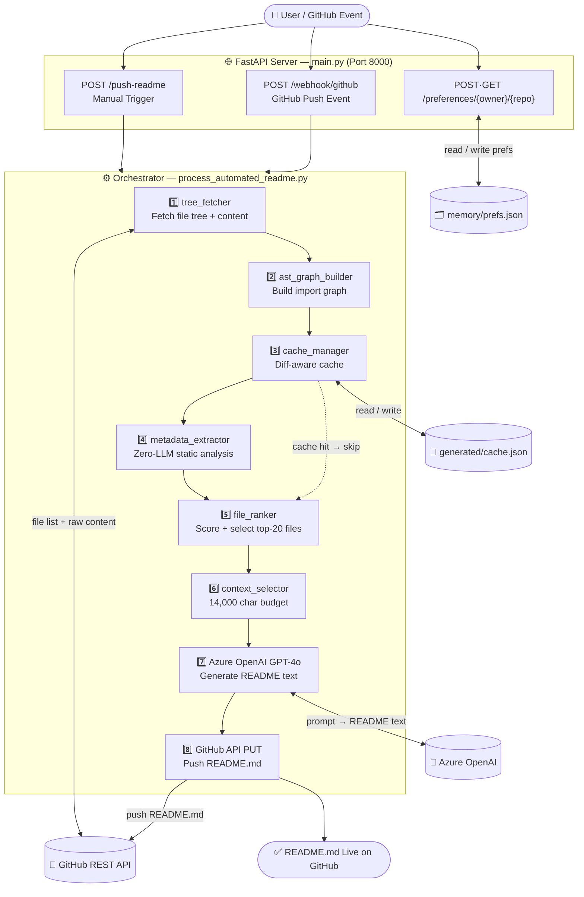

# 📋 PLANNING — DocuGenius: Automated README Generator

**Type:** Orchestrated Pipeline AI Agent | **Port:** `8000` | **LLM:** Azure OpenAI GPT-4o

---

## Architecture Diagram

---

## Module Breakdown

| File | Role |
|------|------|
| `main.py` | FastAPI server — 4 endpoints, HMAC webhook validation, CORS |
| `process_automated_readme.py` | Orchestrator — calls all steps in sequence |
| `repo_summarizer/tree_fetcher.py` | Fetch full file tree + content from GitHub REST API |
| `repo_summarizer/ast_graph_builder.py` | Build import graph — Python AST + JS/TS regex |
| `repo_summarizer/file_ranker.py` | Score files by in-degree, depth, directory heuristics → top-20 |
| `repo_summarizer/context_selector.py` | Pack ranked snippets into 14,000-char prompt budget |
| `repo_summarizer/metadata_extractor.py` | Zero-LLM extraction: endpoints, classes, env vars, deps |
| `repo_summarizer/cache_manager.py` | Diff-aware cache — only re-processes changed files |
| `memory/preferences.py` | Per-repo prefs (tone, sections, badges) in `memory/*.json` |

---

## API Endpoints

| Method | Path | Description |
|--------|------|-------------|
| POST | `/push-readme` | Manually trigger README generation |
| POST | `/webhook/github` | GitHub push webhook (auto-trigger on main) |
| POST | `/preferences/{owner}/{repo}` | Save per-repo preferences |
| GET | `/preferences/{owner}/{repo}` | Get current preferences |

---

## Known Bugs & TODO

**🔴 Fix First**
- [ ] **`hmac.new` bug** (`main.py` line 92) → replace with `hmac.HMAC(...)` — causes `AttributeError` at runtime
- [ ] **Dead code** (`main.py` lines 71–77 after `return`) — remove unreachable block

**🟠 High Priority**
- [ ] Multi-branch support — accept `branch` param in `/push-readme`
- [ ] Retry logic on GitHub API calls (use `tenacity`, 3 retries, exponential backoff)
- [ ] Rate limiting on `/webhook/github` (use `slowapi`, 5 req/min)
- [ ] Stream Azure OpenAI response to avoid 30s timeout

**🟡 Medium**
- [ ] Add `llm_client.py` abstraction with Gemini fallback
- [ ] Extend `metadata_extractor.py` for Go, Java, Rust
- [ ] Add `/health` endpoint
- [ ] Prioritize `Dockerfile`, `Makefile` in `file_ranker.py`

**🟢 Nice to Have**
- [ ] Containerize with Dockerfile
- [ ] `pytest` unit tests for all modules
- [ ] Migrate `requests` → `httpx` async
