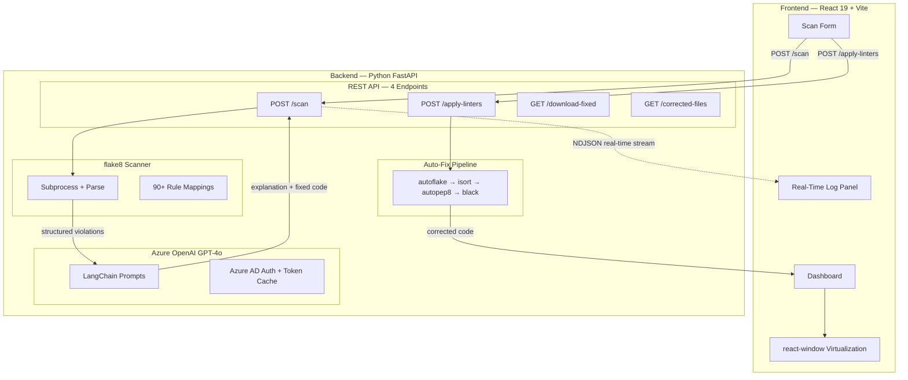

# AI Coding Standards Enforcer — Final Presentation Script

> **Total Time: ~5 minutes** | Read every quoted line out loud. Follow `[ACTION]` cues on screen.

---

## Opening — 15 seconds

> "Hey everyone, I built an AI Coding Standards Enforcer. In short — you paste a GitHub URL, it finds all Python coding standard violations, explains them using AI, and auto-fixes them with one click. Let me walk you through it."

---

## Part 1: Architecture Diagram — 2 minutes 30 seconds

`[Show Diagram 1 — System Architecture]`

> "Here's the system at a high level. There are two main parts — the **frontend** and the **backend**."

> "Starting with the **frontend** — it's built with **React 19** and **Vite** as the build tool. This is where the user interacts. It has a scan form where you paste a GitHub URL, a real-time log panel that shows live progress, and an interactive dashboard with violation cards, filter chips, search, and side-by-side diffs. For performance, we use **react-window** for virtualization, so even if a repo has hundreds of violations, the UI stays fast and doesn't freeze."

> "On the **backend**, we're using **Python FastAPI**. I chose FastAPI because it's async-native, which matters here since we're doing a lot of I/O — cloning repos, running subprocesses, calling external APIs. It has four main components."

> "First, the **REST API layer** — this exposes four endpoints. POST /scan to trigger a scan, POST /apply-linters to run the auto-fix pipeline, GET /download-fixed to download the corrected repo as a zip, and GET /corrected-files to view the fixed code in the browser."

> "Second, the **flake8 Scanner** — flake8 is a well-known Python static analysis tool. We run it as a subprocess, parse its output, and map over **90 rule codes** into human-readable categories like PEP 8 Whitespace, PEP 8 Blank Lines, Pyflakes Unused Imports, and so on. So the user doesn't just see a cryptic code like E302 — they see exactly what standard it falls under."

> "Third, **Azure OpenAI GPT-4o** — this is the AI brain. For every violation flake8 finds, we send the code snippet along with the rule to GPT-4o. It returns two things: a plain-English explanation of **why** the code is wrong, and a corrected version of the code. We use **LangChain** for prompt templating and **Azure AD** for secure authentication with token caching."

> "Fourth, the **Auto-Fix Pipeline** — this is a chain of four industry-standard formatting tools that I'll explain in a moment."

> "Now, an important design decision — the communication between frontend and backend. Notice this **dotted line** labeled NDJSON stream. Instead of the frontend waiting for the entire scan to finish and then getting one big response, we **stream** results in real-time using Newline-Delimited JSON. Every time the backend clones the repo, finds violations, or generates an AI fix, it pushes a log event to the frontend instantly. So the user sees live progress — not a loading spinner for 30 seconds."

`[Show Diagram 2 — Scan Pipeline]`

```mermaid
graph LR
    A["GitHub URL"] --> B["Sanitize URL"]
    B -->|"strip /tree/branch, append .git"| C["git clone → /tmp"]
    C --> D["flake8 Scan"]
    D -->|"file, line, col, rule code"| E["Extract Snippets"]
    E -->|"±5 lines context"| F["Deduplicate"]
    F -->|"cache key: snippet + rule"| G["GPT-4o × 8 Workers"]
    G -->|"explanation + corrected code"| H["Generate Diff"]
    H -->|"difflib.unified_diff"| I["Stream via NDJSON"]
```

> "Let me zoom into the scan pipeline — what happens step-by-step when you click Scan."

> "**Step 1** — we take the GitHub URL, sanitize it — strip out any /tree/branch suffixes, append .git if needed — and then **git clone** it into a temporary directory on the server."

> "**Step 2** — we run **flake8** on the entire cloned repo. Flake8 outputs one violation per line with the file name, line number, column, and the rule code. We parse all of that into structured data."

> "**Step 3** — for each violation, we go back to the actual source file and **extract a code snippet** — roughly 5 lines above and below the violation line. This gives GPT-4o enough context to understand what's happening in the code."

> "**Step 4** — here's where it gets smart. Before sending to the AI, we **deduplicate**. If two violations have the exact same snippet and the same rule code, we only call GPT-4o once and reuse the fix. This saves API cost and time. Then we fire off **parallel async calls** — up to 8 concurrent workers hitting GPT-4o simultaneously. Each call returns an explanation and corrected code."

> "**Step 5** — we generate a **unified diff** between the original and fixed code using Python's difflib, and stream everything back to the frontend as it completes."

`[Show Diagram 3 — Auto-Fix Pipeline]`

```mermaid
graph LR
    A["One-Click Fix"] --> B["autoflake"]
    B -->|"remove unused imports & vars"| C["isort"]
    C -->|"sort imports, Black-compatible"| D["autopep8"]
    D -->|"fix PEP 8, aggressive mode"| E["black"]
    E -->|"opinionated formatting"| F["Re-scan with flake8"]
    F -->|"remaining violations"| G["Final Report"]
```

> "Now the auto-fix pipeline. After the user reviews the AI suggestions, they can click one button to auto-fix everything. The order of these tools matters."

> "**autoflake** goes first — it removes unused imports and unused variables. Things like `import os` when os is never used."

> "**isort** goes second — it sorts and organizes all the import statements into the correct groups: standard library, third-party, and local imports. It's configured to be Black-compatible so they don't conflict."

> "**autopep8** goes third — it fixes PEP 8 violations like wrong indentation, missing blank lines, extra whitespace. We run it in aggressive mode for maximum coverage."

> "**black** goes last — it's an opinionated code formatter that enforces a consistent style across the entire codebase. Line length, quote style, trailing commas — all standardized."

> "After all four tools run, we **re-scan** with flake8 to see how many violations remain. Usually it goes from dozens down to zero."

---

## Part 2: Code Highlights — 1 minute 30 seconds

`[Show the project folder structure in your IDE]`

> "Quick look at the code. The entire backend fits in about 6 focused Python modules."

> "First, **main.py** — this is the FastAPI entry point. Four endpoints: scan, apply-linters, download-fixed, and corrected-files. The scan endpoint uses StreamingResponse for real-time NDJSON output."

> "Second, **scan_service.py** — runs flake8 as a subprocess, parses the output, and maps 90+ rule codes to human-readable categories like PEP 8 Whitespace or Pyflakes Unused Imports."

> "Third, **ai_service.py** — this is where the AI magic happens. Uses LangChain with Azure OpenAI. We deduplicate identical violations to save API calls, then run parallel async calls to GPT-4o. Each response is parsed into an explanation and a corrected code block."

> "Fourth, **llm_provider.py** — handles Azure AD authentication with token caching so we're not re-authenticating on every request."

> "And on the frontend, **App.jsx** — single-page React app. It handles the scan form, real-time log panel, filter chips by coding standard, searchable violation cards with side-by-side diffs, and a corrected files viewer. Large datasets are handled using react-window for virtualization."

---

## Part 3: Live Demo — 2 minutes

`[Open browser → http://localhost:5173]`

> "Let me show you it in action."

---

`[Screen shows the app with the heading and empty input field]`

> "This is the interface. Simple — pick a source, paste a link, hit scan."

---

`[Paste https://github.com/ArifRahaman/deepgram_bot into the input, click "Scan Repository"]`

> "I'll paste a real GitHub repo — a small Deepgram text-to-speech bot. Clicking Scan Repository now."

---

`[Point to the Scan Logs panel as entries appear]`

> "Watch the logs streaming in real-time. It cloned the repo in two seconds, ran flake8, found 3 violations, sent them to GPT-4o, and all 3 AI fixes came back in under 3 seconds. Whole scan done in about 5 seconds."

---

`[Scroll down to show the violation cards and filter chips]`

> "Here's the results. 3 violations total. The filter chips show — 2 are PEP 8 Blank Lines issues, 1 is a Pyflakes Imports issue meaning an unused import. You can click any chip to filter or use the search bar."

---

`[Point to the first violation card — F401]`

> "First violation — F401, module imported but unused. It's in app.py, line 1. The AI says the os module is imported but never used, so it should be removed. The side-by-side diff shows import os on the left, and it's gone on the right. Clean."

---

`[Point to the second violation card — E302]`

> "Second — E302, expected 2 blank lines before a function definition. PEP 8 requires that. The code only had one blank line before text_to_speech. The fix adds the extra blank line."

---

`[Point to the third violation card — E305]`

> "Third — E305, same idea. Expected 2 blank lines before the if name equals main block. AI explains why and shows the fix."

---

`[Scroll to Step 2, click "Run Linters & Formatters"]`

> "Now instead of fixing manually, I'll click Run Linters and Formatters. This chains autoflake, isort, autopep8, and black in sequence."

> "Done — 3 violations fixed, 0 remaining. Clean bill of health."

---

`[Expand the corrected file viewer showing app.py]`

> "Here's the corrected file. Import os is gone, imports are sorted, blank lines are in the right places. Production-ready code."

---

`[Point to the Download button]`

> "You can copy individual files or download the entire fixed repo as a zip. One click, done."

---

## Closing — 15 seconds

> "So that's the full loop — paste a URL, scan in seconds, get AI-powered explanations for every violation, auto-fix with one click, download the clean code. It saves developers time on code reviews and enforces consistent standards across projects. Happy to take any questions!"
